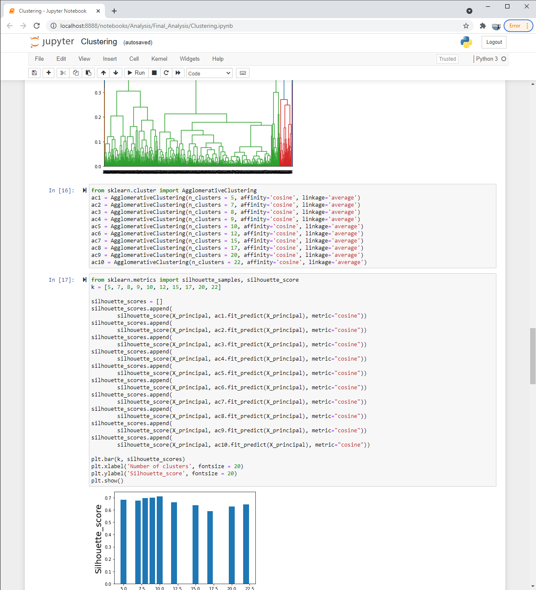

# Campground Characteristic Analysis of Campgrounds in CA, OR, and WA

###  Re-thinking the Final Group Project for Data Analysis Bootcamp.

Original repo: https://github.com/shadiaduery/Machine-Learning-Tableau

Original visualizations:
- Tableau Slide Deck 1: https://public.tableau.com/profile/shadia.duery#!/vizhome/Final-Project_twbx_16159324170940/Story1?publish=yes
- Tableau Slide Deck 2: https://public.tableau.com/profile/shadia.duery#!/vizhome/Camping_16160189818690/Story?publish=yes

Collaborators: 

Priya Arunachalam, Nataliia Sokolova, Vincent Durcan, Shadia Duery, and Anna Rischitelli

### Business Question:

We are a team of consultants hired to determine where to distribute financial resources among the federal campgrounds in Washington, Oregon, and California. Our goal is to identify which, if any, campground characteristics impact a campground's popularity, so we can make decisions about future funding of our most popular campgrounds.

In short,
- What characteristics describe the most popular campgrounds in Washington, Oregon, and California?

### Project Description:

We analyzed a dataset from Recreation.gov to help us answer our business question: "what characteristics make a campsite popular?". In order to identify which campgrounds are popular, we needed to define "popularity". We chose 4 dimensions to represent "popularity", which drove our cluster analysis.

*Popularity is defined by:

- Demand (# of reservations/# of campsites)
- How far in advance reservations are booked (median time from reservation date to start date) - create normal distribution
- How far in advance reservations are booked (minimum time from reservation date to start date) - identify outliers
- Average number nights in reservations

In addition to our popularity metrics, we also explored if the demand for types of campsites (tenting, group, remote, and RV & Structured), and the bundle of recreational activities found around the campground affected a campground's demand. First we cleaned the data using Python (Jupyter Notebooks) since our dataset was so large. We changed the data types to allow for calculations, and checked for NaN values. We filtered the data in different datasets that would allow us to go deeper into the analysis. Because we had multiple dimensions from our definition of "popularity", we opted to use cluster analysis (Sklearn AgglomerativeClustering) in order to differentiate our campground into different groups. For our exploratory analysis and final visualizations, we used Tableau. 

### Data Sources:
-Recreation.gov: https://ridb.recreation.gov/download
- Dataset was built with three filters:
    - Camping Season (May 1- Sep 30) for 2016-2020;
    - Only reservable online campsites;
    - Federal campgrounds located in Washington, Oregon and California (West Coast).
* Due to a large size of initial data (more then limit of GitHub) all data did not fit in this repo, external resources were used for creating this project. 

### Tools Used:
Tableau, Python Scripting (Python 3, Pandas, NumPy, Matplotlib, Unsupervised machine learning (cluster analysis Sklearn Agglomerative Clustering)).

### What am I working with now:
I was truly excited about this project. Unfortunately, the limited amount of time that was given for compleating Final project did not allow to fully incorporate all of ideas. Present points of interests includes:
- cleaning data optimization;
- clustering campgrounds using camp activities as characteristics;
- deeper dive into campsites types as attribute of a campground popularity.
